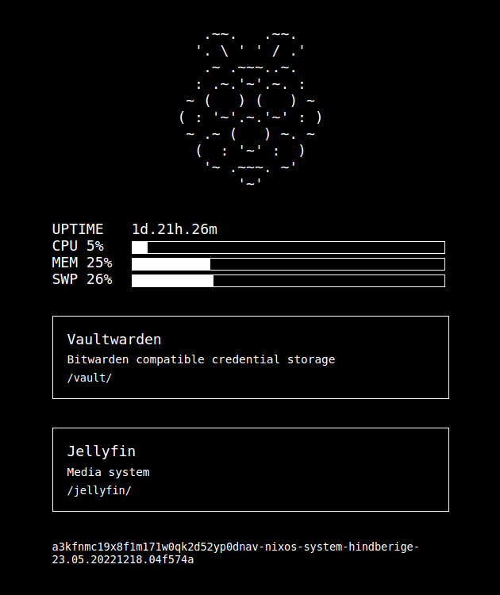

ansíne
  noun: a view, sight, figure

Ansíne is a lightweight, simple, slightly-configurable dashboard intended for
a linux home server. It displays simple system metrics like average cpu idle,
memory usage and uptime, as well as configurable links to services running
on the home server. Only intended to be run in Linux environments, like NixOS.

Building
--------

To build::

  λ nix build

Configuration
-------------

Ansíne expects an environment variable named ``ANSINE_CONFIG_PATH`` to be present and pointing to a JSON configuration file.

The configuration options are:

+------------------------+-------------------------------------------------------+---------------+
| Option                 | Description                                           | Default       |
+========================+=======================================================+===============+
| ``port``               | The port that the ansine service will listen on.      |    ``3000``   |
+------------------------+-------------------------------------------------------+---------------+
| ``nixosCurrentSystem`` | Whether or not to determine the current NixOS system  |   ``false``   |
|                        | from ``/run/current-system``.                         |               |
+------------------------+-------------------------------------------------------+---------------+
| ``services``           | A set of services to display links to. Of the form::  |    ``{ }``    |
|                        |                                                       |               |
|                        |  ServiceName: {                                       |               |
|                        |      "description": "Service Description",            |               |
|                        |      "route": "/route-to-service"                     |               |
|                        |   }                                                   |               |
+------------------------+-------------------------------------------------------+---------------+
| ``refreshInterval``    | Determines the interval, in seconds, in which to      |    ``10``     |
|                        | refresh the system metrics. Also determines how often |               |
|                        | the front-end requests updated metrics.               |               |
+------------------------+-------------------------------------------------------+---------------+

NixOS Module
------------

Ansíne can also be installed as a NixOS module:

.. code-block:: nix

  {
    inputs.ansine.url = "github:autophagy/ansine";

    outputs = { self, nixpkgs, ansine }: {
      nixosConfigurations.yourhostname = nixpkgs.lib.nixosSystem {
        system = "x86_64-linux"; # or whatever your system is
        modules = [
          ./configuration.nix
          ansine.nixosModules.default
        ];
      };
    };
  }

It can then be enabled and configured like so:

.. code-block:: nix

  {
    services.ansine = {
      enable = true;
      port = 3134;
      refreshInterval = 3;
      services = {
        Jellyfin = {
          description = "Media system";
          route = "/jellyfin/";
        };
        Vaultwarden = {
          description = "Bitwarden compatible credential storage";
          route = "/vault/";
        };
      };
    };
  }
